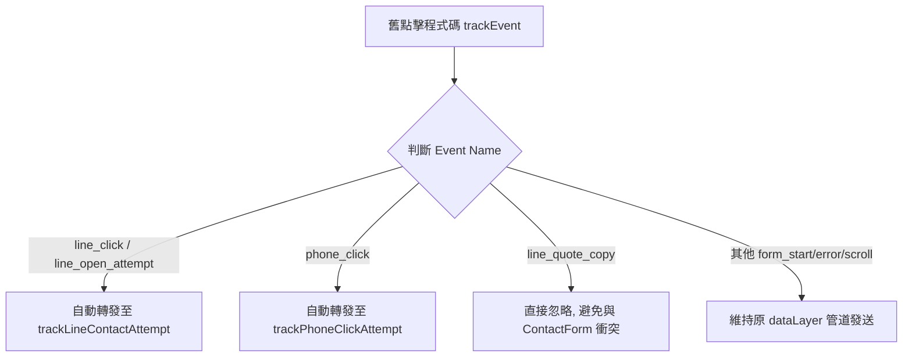

# 焓耀空調工程 xusen.pro 轉換追蹤架構修正計劃

本文件說明「焓耀空調工程」網站全新轉換追蹤架構的設計與實作。此架構能徹底解決 Google Ads / PMax 廣告帳戶因「重複計數」及「把普通點擊當主要轉換」所導致的出價數據污染問題。

---

## 1. 核心設計原則

1.  **事件語意統一化**：不再細分 `line_click` 與 `line_quote_copy` 作為多個獨立轉換，而是統一彙總至「聯繫嘗試（Attempt）」層級。
2.  **次要轉換降級（Secondary Conversion）**：網站端的所有點擊嘗試（LINE 點擊、撥號點擊）在 Google Ads 中**僅能設定為次要轉換**，僅供觀察，不參與 PMax 及搜尋廣告的智慧出價優化。
3.  **防重複防污染防護罩（Dedupe Layer）**：利用 `sessionStorage` 限制 30 秒內同一使用者重複點擊時，不重複向 dataLayer 推送事件。
4.  **個資安全防護層（Privacy Safe Layer）**：由中央追蹤工具強制過濾所有推送至 dataLayer 的參數，嚴格禁止姓名、電話、諮詢文字等任何個人隱私資料送入 GA4 或 Google Ads。

---

## 2. 新事件語意設計

### A. `line_contact_attempt` (LINE 聯繫嘗試)
*   **用途**：當使用者在網站上點擊直接開 LINE 的按鈕，或是表單填寫完點擊「複製諮詢內容並開啟 LINE」時觸發。
*   **非敏感 dataLayer 格式**：
    ```json
    {
      "event": "line_contact_attempt",
      "contact_channel": "line",
      "contact_method": "line_link_open" | "form_copy_open_line",
      "lead_id": "HY-YYYYMMDD-XXXXXX" (僅 form_copy_open_line 包含，普通點擊無此欄位),
      "page_path": "/current-page-path",
      "event_source": "header_cta" | "sticky_cta" | "hero_cta" | "contact_form" | "service_page" | "footer_cta" | "contact_page" | "unknown",
      "timestamp": 1719999999999
    }
    ```

### B. `phone_click_attempt` (電話點擊嘗試)
*   **用途**：當使用者在網站上點擊 `tel:` 連結嘗試撥號時觸發。
*   **非敏感 dataLayer 格式**：
    ```json
    {
      "event": "phone_click_attempt",
      "contact_channel": "phone",
      "contact_method": "tel_click",
      "page_path": "/current-page-path",
      "event_source": "header_cta" | "sticky_cta" | "hero_cta" | "service_page" | "footer_cta" | "contact_page" | "unknown",
      "timestamp": 1719999999999
    }
    ```

---

## 3. 程式碼架構與事件對應 (Compatibility Layer)

為了避免直接刪除舊事件導致 Google Analytics 4 (GA4) 舊報表斷裂，我們採取了「中央攔截與相容對應」的設計：



透過此設計，我們無須修改全站幾十個調用 `trackEvent` 舊 API 的頁面，即可自動且安全地將全站事件升級為全新語意，並無縫套用 30 秒的短時間防重複 (Dedupe) 機制與個資過濾安全層。
