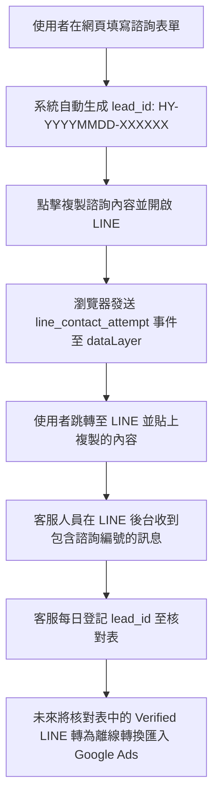

# 焓耀空調工程 LINE 真實轉換追蹤與離線匯入方案

由於 LINE 官方帳號開啟是外部跳轉行為，網頁端的 GTM 無法 100% 確認使用者是否真的在 LINE 裡面加為好友，亦無法確認使用者是否真的送出諮詢訊息。

若將普通點擊事件（line_click / line_contact_attempt）直接做為 Google Ads 主要轉換，會導致大量點擊後未發言的無效流量污染 PMax / Leads 出價。

本方案說明如何利用我們在表單新增的 **諮詢編號 (lead_id)**，透過人工核對與離線轉換匯入，實現 LINE 轉換的 100% 精準追蹤。

---

## 1. 運作流程與機制

---

## 2. 實作細節

### A. 網站端：諮詢編號自動帶入
*   當使用者在 [ContactForm.tsx](file:///Users/joy/Documents/air%20web/src/components/ContactForm.tsx) 填寫完畢，點擊「複製諮詢內容並開啟 LINE」時，系統會動態生成例如 `HY-20260704-A8F3K2` 的編號。
*   複製到剪貼簿的文字會包含：
    `【諮詢編號】HY-20260704-A8F3K2`
*   同時，`dataLayer` 中會送出 `line_contact_attempt` 事件，其 `lead_id` 為 `HY-20260704-A8F3K2`。

### B. 客服端：每日人工核對
客服或網站管理員應建立一份 Excel 或 Google Sheets 試算表（LINE 客服核對表），欄位如下：

| 日期時間 | 諮詢編號 (lead_id) | 狀態 | 客戶需求 | 是否為真實有效對話 | 備註 |
| :--- | :--- | :--- | :--- | :--- | :--- |
| 2026/07/04 14:30 | HY-20260704-A8F3K2 | 已收到對話 | 家用冷氣漏水 | 是 | 客戶已約定場勘 |
| 2026/07/04 15:15 | HY-20260704-B9D1X5 | 未收到對話 | - | 否 | 使用者複製後未在 LINE 送出 |

當使用者在 LINE 貼上並傳送訊息後，客服便能看到該編號，並在試算表中將其標記為「是（真實有效對話）」。

---

## 3. Google Ads 離線轉換匯入 (Offline Conversion Import, OCI)

透過離線轉換匯入，我們可以將在 LINE 官方帳號上「真正完成客服對話」的人數回傳給 Google Ads，作為最純淨的主要出價信號：

1.  **收集 GCLID / 廣告參數**：
    *   我們的 `pushSafeDataLayerEvent` 已確保將所有追蹤參數正常發送。GTM 亦能透過 `Conversion Linker` 自動抓取 `gclid`。
    *   我們可以將 `gclid` 存入 `sessionStorage` 或 `localStorage`。如果使用者是從 Google Ads 來，當他們填寫表單時，我們除了 lead_id 外，也可以將 lead_id 與 gclid 進行關聯（若有需要，可在後台資料庫對齊）。
2.  **基於時間與增強型轉換 (Enhanced Conversions) 匯入**：
    *   即使不收集 gclid，我們也可以利用 Google Ads 的 **離線轉換 (以電話號碼或電子郵件匹配)**，將在 LINE 上對齊的有效諮詢客人的電話號碼與姓名，在去識別化（Hash）後匯入 Google Ads。
    *   Google Ads 會比對在過去 30 天內，是哪些廣告點擊促成了這些有效 LINE 諮詢。
3.  **主要出價優化**：
    *   在 Google Ads 建立一個名為 `Verified LINE Contact` 的主要轉換（Primary Conversion）。
    *   將網頁上的點擊 `line_contact_attempt` 設為次要轉換（Secondary Conversion）。
    *   這樣一來，PMax 廣告便會以「真正有在 LINE 裡發言的客戶」為優化目標，而不是點了按鈕就跑掉的流量。
